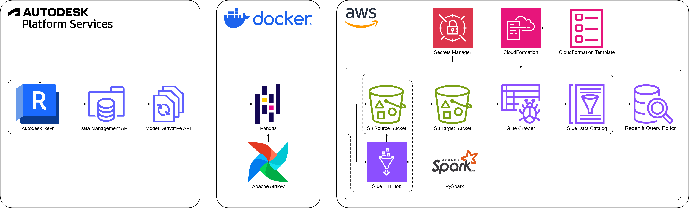
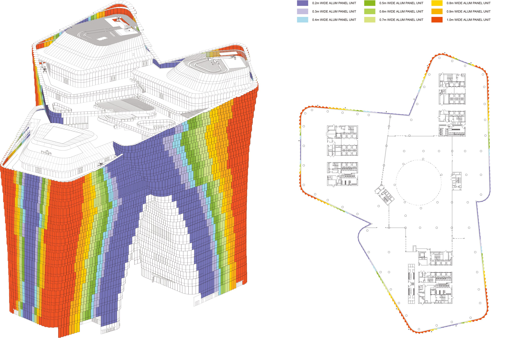
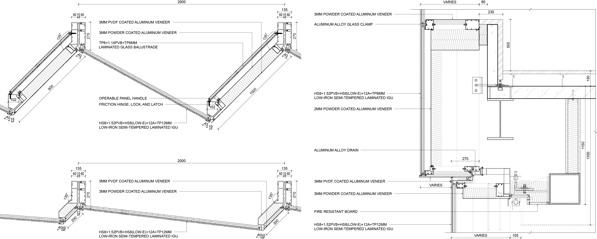

<div style="position: fixed; bottom: 0; left: 0; width: 100%; background-color: #ffffff; border-top: 1px solid #cccccc; padding: 10px; text-align: center; z-index: 1000;">
    <a href="https://siconge.github.io/">Back to Portfolio</a>
    <!-- style="color: #333333; font-family: Arial, sans-serif; text-decoration: none;" -->
</div>

# Tencent Headquarters BIM Data Pipeline Using Apache Airflow, AWS Services, and Autodesk Platform Services

This project delivers an end-to-end data pipeline solution designed to process BIM (Building Information Modeling) data from the Revit model of Tencent Global Headquarters in Shenzhen. Developed during the design and construction phases, the pipeline efficiently handles unitized curtain wall metadata to support data-driven decision-making.

Integrating upstream metadata extraction and pre-processing from Autodesk BIM 360 and downstream cloud-based storage, partitioning, schema cataloging, and analytics using AWS services, the pipeline leverages Apache Airflow, Autodesk Platform Services (APS) APIs, AWS CloudFormation, Amazon S3, AWS Glue, and Amazon Redshift. It enables automated, scalable workflows for data extraction, transformation, and storage.

Tailored for design teams, technical consultants, and Tencent clients, the solution supports precise construction detail modifications, cost optimization, and regulatory compliance with standards for energy consumption and fire protection. Its modular and iterative BIM data processing approach adapts to evolving design requirements while preserving architectural integrity.

[Go to repository](https://github.com/siconge/Tencent-HQ-BIM-Data-Pipeline-with-AWS)

<h2>Table of Contents</h2>

- [Pipeline Workflow](#pipeline-workflow)
- [Architecture](#architecture)
- [Technologies Used](#technologies-used)
- [Prerequisites](#prerequisites)
- [System Setup](#system-setup)
- [Project Context and Data Source](#project-context-and-data-source)

[Back to top](#tencent-headquarters-bim-data-pipeline-using-revit-apache-airflow-and-aws-services)

### Pipeline Workflow
1. **Infrastructure Deployment**:
   - Define and provision AWS resources using AWS CloudFormation templates to ensure a scalable foundation for the pipeline.
2. **Data Extraction**:
   - Extract BIM data through APS API, targeting metadata such as curtain wall attributes.
3. **Data Transformation**:
   - Engineer features (e.g., operable area, embodied carbon, and facade costs) using Python libraries like Pandas and NumPy.
4. **Data Validation and Loading**:
   - Validate and save transformed data locally as CSV files before uploading to Amazon S3.
5. **ETL in AWS Glue**:
   - Apply additional transformations in Glue, including timestamp-based partitioning and schema validation for efficient querying.
6. **Amazon Redshift Spectrum Integration**:
   - Query S3-stored data using Redshift Spectrum via Glue Data Catalog. This approach aligns with AWS's data lake architecture, enabling analytics and insights without duplicating data storage.

[Back to top](#tencent-headquarters-bim-data-pipeline-using-revit-apache-airflow-and-aws-services)

## Architecture

1. **Autodesk Revit Model in BIM 360**: Data source hosted on a cloud-based construction management platform.
2. **APS Data Management API**: Manages authentication and retrieves access to Revit files stored in BIM 360.
3. **APS Model Derivative API**: Extracts metadata from 3D models in Revit for downstream processing.
4. **Apache Airflow**: Orchestrates ETL processes and manages task dependencies.
5. **AWS CloudFormation**: Automates provisioning of AWS resources for the pipeline.
6. **AWS Secrets Manager**: Securely stores APS client credentials for authentication with APS APIs without hardcoding.
7. **Amazon S3**: Provides scalable storage for raw data, partitioned data, and PySpark-based Glue job scripts.
8. **AWS Glue**: Facilitates ETL jobs, data schema crawling, and metadata table cataloging.
9. **Amazon Redshift**: Acts as the data warehouse for analytics, interactive queries, and built-in visualization.

[Back to top](#tencent-headquarters-bim-data-pipeline-using-revit-apache-airflow-and-aws-services)

## Technologies Used
- **Programming Languages**: Python (Pandas, NumPy, PySpark, Requests)
- **ETL Orchestration**: Apache Airflow
- **Cloud Services**: AWS CloudFormation, AWS Secrets Manager, Amazon S3, AWS Glue, Amazon Redshift
- **APIs**: APS (Data Management API, Model Derivative API), AWS SDK for Python (Boto3)

[Back to top](#tencent-headquarters-bim-data-pipeline-using-revit-apache-airflow-and-aws-services)

## Prerequisites
- **Revit Model**: A Revit model hosted and managed in BIM 360.
- **APS API Credentials**: Obtain required credentials (client ID and client secret) for API access.
- **AWS Account**: Ensure sufficient permissions for S3, Glue, and Redshift services.
- **Docker Installation**: Install Docker to run Airflow in a containerized environment.
- **Python Version**: Use Python 3.9 or higher for running the scripts and configurations.

[Back to top](#tencent-headquarters-bim-data-pipeline-using-revit-apache-airflow-and-aws-services)

## System Setup
1. Clone the repository.
2. Register your app in the Autodesk Developer Portal to obtain APS client credentials:
    - Create an app and note the client ID and client secret.
    - Ensure your Revit model is accessible in BIM 360.
3. Configure AWS environment:
    - Create an IAM user with `AdministratorAccess` policy.
    - Store APS client credentials and AWS access keys securely in AWS Secrets Manager.
    - Update `conf/config.conf` with the following values:
        - Names of secrets for APS client credentials and AWS access keys.
        - Project ID, Item ID, and Model View name of your model in BIM 360.
        - S3 bucket name matching the `aws-resource-stack-deploy.yaml` template.
        - Glue job name customized to your specific requirements.
4. Deploy AWS Resources Using CloudFormation:
    - Locate the `aws-resource-stack-deploy.yaml` template in the root directory.
    - Open the template and update the `Parameters` section with custom values tailored to your project.
    - Create the stack using Amazon CloudFormation to provision AWS resources, including configurations of the following:
        - S3Bucket
        - S3BucketPolicy
        - GlueDatabase
        - GlueJob
        - GlueServiceRole
        - RedshiftServerlessNamespace
        - RedshiftServerlessWorkgroup
        - RedshiftServiceRole
5. Set up Docker for Apache Airflow:
    - Locate the `docker-compose.yaml` template in the root directory.
    - Verify that the following structure aligns with the Airflow scripts and resources mapped to the container's file system:
        ```
        └── root
            ├── airflow.env        
            ├── aws_glue_job_script
            │   └── partition_job.py
            ├── config
            │   └── config.conf
            ├── dags
            │   └── bim_aws_dag.py
            ├── data
            │   └── output
            ├── etls
            │   ├── aws_etl.py
            │   ├── bim_etl.py
            │   └── __init__.py
            ├── pipelines
            │   ├── aws_pipeline.py
            │   ├── bim_pipeline.py
            │   └── __init__.py
            ├── utils
            │   ├── constants.py
            │   └── __init__.py
            ├── docker-compose.yaml
            └── requirements.txt
        ```
    - The following auxiliary files and folders are included in the repository for additional context but are not mapped to the container's file system:
        - `README.md` (documentation)
        - `assets` (images used in `README.md`)
        - `data/output/prefix_yyyyMMdd_suffix.csv` (example CSV output for reference)
        - `aws-resource-stack-deploy.yaml` (CloudFormation template for optional AWS setup)
        - `amazon_redshift_queries/latest_partition_view.ipynb` (example Redshift query notebook demonstrating late-binding views for partitioned BIM data)

6. Configure Airflow environment:
    - Update `airflow.env` with the following values:
        - Host server address used by Airflow when sending out email notifications via SMTP, through value of `AIRFLOW__SMTP__SMTP_HOST`.
        - Username to authenticate when connecting to SMTP server, through value of `AIRFLOW__SMTP__SMTP_USER`.
        - Password to authenticate when connecting to SMTP server, through value of `AIRFLOW__SMTP__SMTP_PASSWORD`.
        - Default "from" email address used when Airflow sends email notifications, through value of `AIRFLOW__SMTP__SMTP_MAIL_FROM`.
7. Start Docker container for Apache Airflow.
    ```bash
    docker compose up
    ```
8. Launch the Airflow web UI.
    ```bash
    open http://localhost:8080
    ```
9. Deploy the Airflow DAG and start the pipeline:
    - Run the following command to trigger the DAG:
        ```bash
        docker compose exec airflow-webserver airflow dags trigger bim_aws_dag
        ```
    - Alternatively, trigger the DAG manually from the Airflow web UI.
10. After this pipeline is executed, the S3 bucket should have the following structure:
    ```
    └── s3-bucket-name
        ├── aws_glue_assets/
        │   ├── scripts/
        │   │   └── prefix_partition_job.py
        │   └── temporary/
        ├── partitioned/
        │   ├── timestamp=yyyy-MM-ddTHH:mm:ss.SSSZ/
        │   └── ...
        └── raw/
            ├── prefix_yyyyMMdd_suffix.csv
            └── ...
    ```

[Back to top](#tencent-headquarters-bim-data-pipeline-using-revit-apache-airflow-and-aws-services)

## Project Context and Data Source
To provide context for the data pipeline, here are some architectural renderings, facade diagrams, and construction details from the Tencent Global Headquarters project. These visuals highlight the unitized curtain wall system, a key focus of the BIM data used in this pipeline.

#### Architectural Renderings


#### Facade Diagrams


#### Construction Details of Unitized Curtain Wall System


[Back to top](#tencent-headquarters-bim-data-pipeline-using-revit-apache-airflow-and-aws-services)

&#160;
