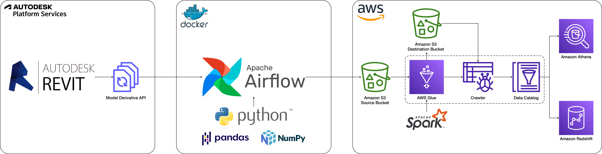

    <a href="https://siconge.github.io/">Back to Portfolio</a>
    <!-- style="color: #333333; font-family: Arial, sans-serif; text-decoration: none;" -->

# Tencent Headquarters BIM Data Pipeline Using Revit, Apache Airflow, and AWS Services

This project delivers a robust data pipeline solution designed to efficiently handle BIM (Building Information Modeling) data from the Revit model of Tencent's Global Headquarters in Shenzhen. As the Lead Project Architect and BIM Data Engineer, I oversaw the design and construction phases, ensuring seamless integration and data management.

This data pipeline employs a comprehensive ETL (Extract, Transform, Load) process to move BIM data from Autodesk Revit into cloud storage for processing and analytics. The pipeline leverages tools and services such as Apache Airflow, Amazon S3, AWS Glue, Amazon Athena, and Amazon Redshift.

Specifically designed to serve the design team, technical consultants, and Tencent clients, this pipeline supports informed decision-making, construction detail modifications, cost estimation, and compliance with local regulations such as energy consumption, window-to-wall ratio, and fire protection standards. The focus on the unitized curtain wall system demonstrates how data-driven processes assist in fine-tuning design and construction details to meet various code requirements while maintaining the overall design intent. This approach ensures precise tracking and management of architectural elements, enhancing overall project outcomes.

[Go to repository](https://github.com/siconge/Tencent-HQ-BIM-Data-Pipeline-with-AWS)

<h2>Table of Contents</h2>

- [Overview](#overview)
- [Benefits](#benefits)
- [Architecture](#architecture)
- [Prerequisites](#prerequisites)
- [Project Context and Data Source](#project-context-and-data-source)

[Back to top](#tencent-headquarters-bim-data-pipeline-using-revit-apache-airflow-and-aws-services)

## Overview
The pipeline is designed to:
1. **Data ETL**: Employ Apache Airflow to orchestrate ETL processes.
   - Extract data from Autodesk Revit model using the APS (Autodesk Platform Services) API.
   - Pre-process the data using Pandas.
   - Load the pre-processed raw data into an Amazon S3 bucket.
2. **Cloud Storage and Processing**: Leverage AWS services for advanced data handling.
   - Implement an AWS Glue job in script mode utilizing PySpark to further refine the raw data and store the transformed data into a designated S3 bucket.
   - Deploy an AWS Glue Crawler to catalog the transformed data.
   - Perform interactive queries on the cataloged data using Amazon Athena, saving query results in a specified S3 bucket.
   - Load the cataloged data into Amazon Redshift for advanced analytics and reporting.

[Back to top](#tencent-headquarters-bim-data-pipeline-using-revit-apache-airflow-and-aws-services)

## Benefits
- **Enhanced Design Decision-Making**: Real-time data updates for design iterations.
- **Improved Construction Modifications**: Accurate and timely data for detail adjustments.
- **Cost Estimation**: Reliable data for precise cost analysis.
- **Regulatory Compliance**: Ensuring adherence to energy consumption, window-to-wall ratio, and fire protection requirements.

[Back to top](#tencent-headquarters-bim-data-pipeline-using-revit-apache-airflow-and-aws-services)

## Architecture

1. **Autodesk Revit Model in BIM 360**: Data source from a BIM project in the cloud-based construction management platform.
2. **Model Derivative API**: APS (Autodesk Platform Services) API for extracting 3D model metadata.
3. **Apache Airflow**: ETL process orchestration and task distribution management.
4. **Amazon S3**: Scalable storage for raw data, transformed data, and query results.
5. **AWS Glue**: ETL jobs and data cataloging.
6. **Amazon Athena**: Interactive queries of SQL-based data.
7. **Amazon Redshift**: Data warehousing and analytics.

[Back to top](#tencent-headquarters-bim-data-pipeline-using-revit-apache-airflow-and-aws-services)

## Prerequisites
- Revit model managed in BIM 360.
- APS credentials.
- AWS account with appropriate permissions for S3, Glue, Athena, and Redshift.
- Docker installation.
- Python 3.9 or higher.

[Back to top](#tencent-headquarters-bim-data-pipeline-using-revit-apache-airflow-and-aws-services)

## Project Context and Data Source
To provide context for the data pipeline, here are some architectural renderings, facade diagrams, and construction details from the Tencent Global Headquarters project. These visuals highlight the unitized curtain wall system, a key focus of the BIM data used in this pipeline.

#### Architectural Renderings

#### Facade Diagrams

#### Construction Details of Unitized Curtain Wall System

[Back to top](#tencent-headquarters-bim-data-pipeline-using-revit-apache-airflow-and-aws-services)

&#160;